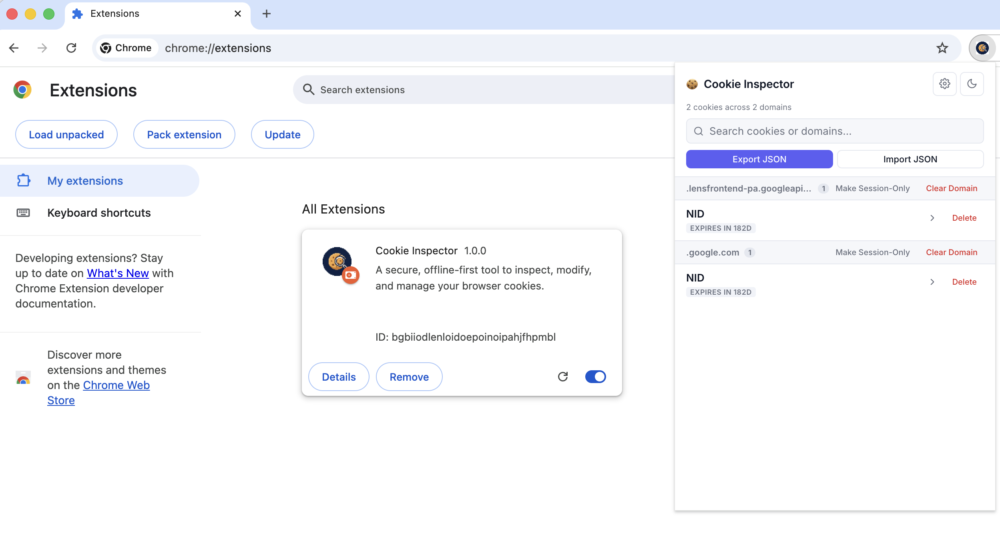
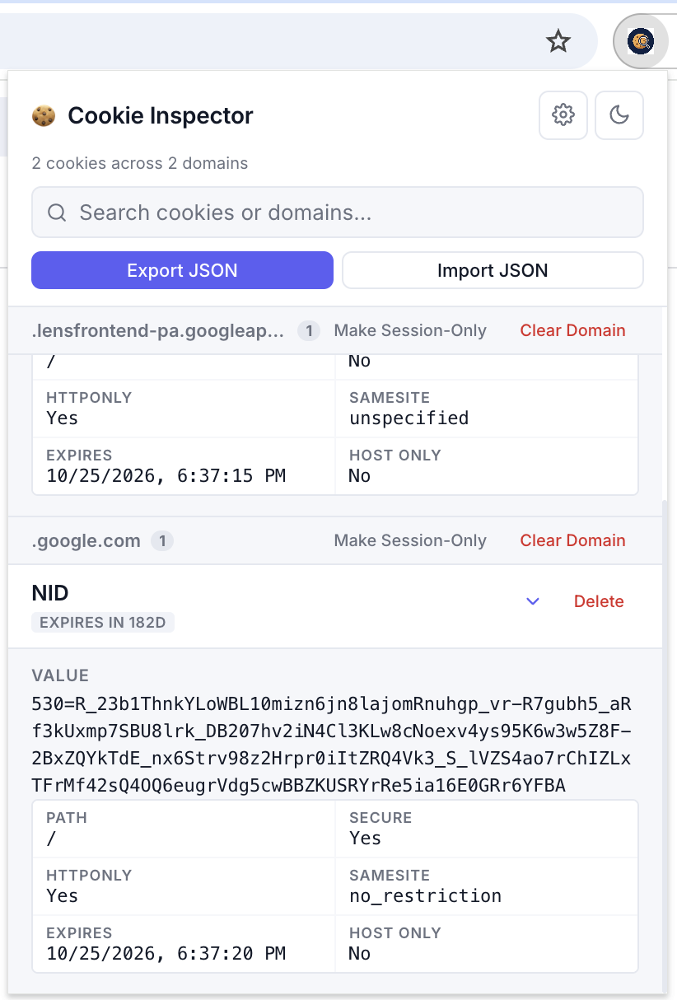
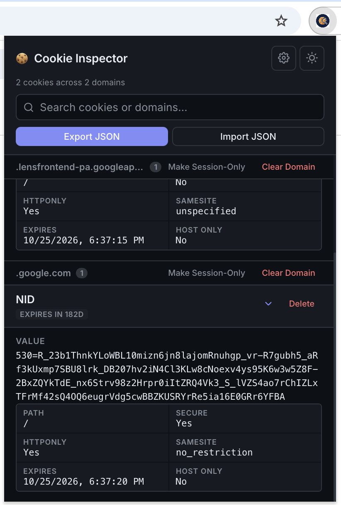
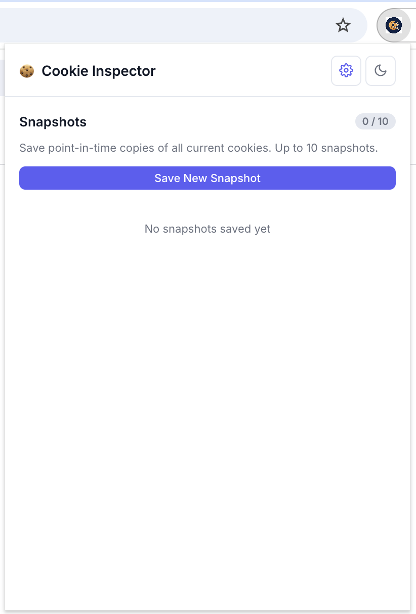
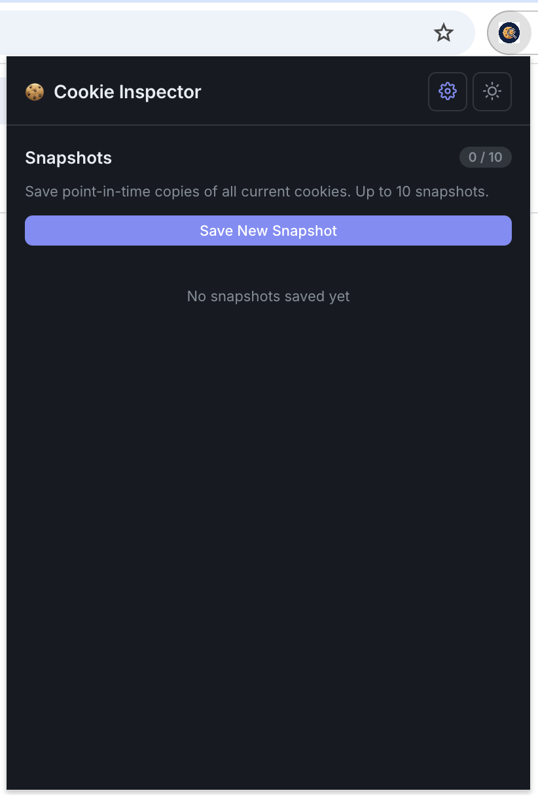
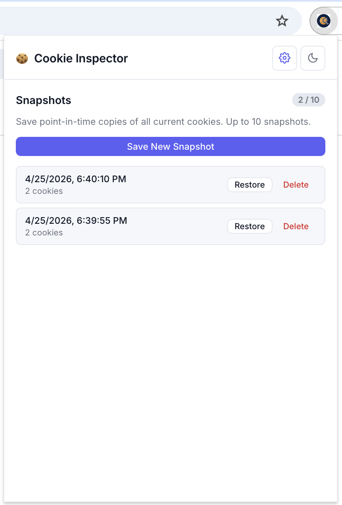
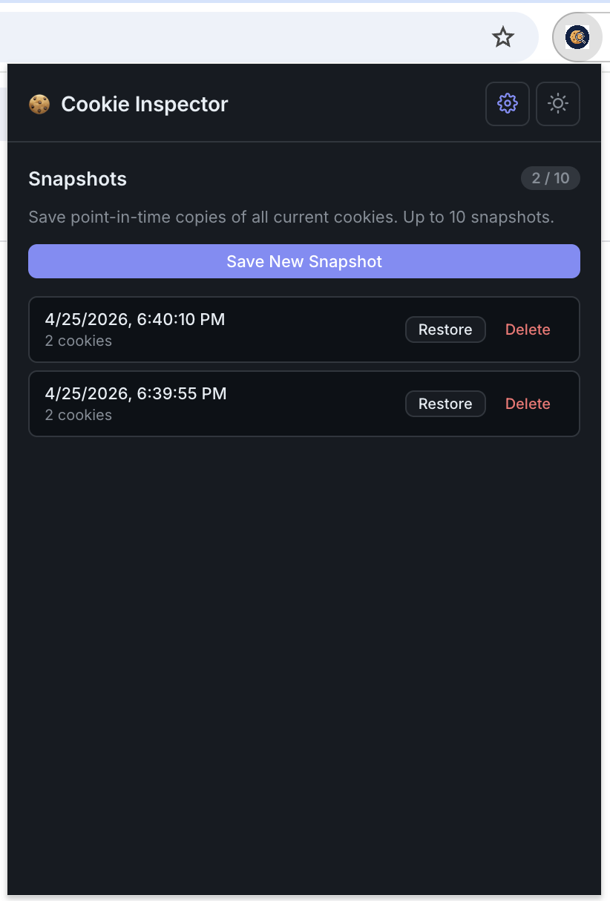

# 🍪 Cookie Inspector

A clean, offline-first Chrome extension for inspecting, decoding, and managing browser cookies — with dark mode, snapshots, and import/export.

<!-- Chrome Web Store badge — add once approved -->
<!-- [](https://chrome.google.com/webstore/detail/EXTENSION_ID) -->

> **Chrome Web Store listing coming soon.**

---

## Screenshots



**Cookie Inspector — Main View**
View and search all cookies grouped by domain, with security indicators and expandable detail panels.

<table>
  <tr>
    <td align="center"><strong>Light Mode</strong></td>
    <td align="center"><strong>Dark Mode</strong></td>
  </tr>
  <tr>
    <td></td>
    <td></td>
  </tr>
</table>

**Snapshots**
Save up to 10 point-in-time copies of your cookies and restore them at any time.

<table>
  <tr>
    <td align="center"><strong>Light Mode</strong></td>
    <td align="center"><strong>Dark Mode</strong></td>
  </tr>
  <tr>
    <td></td>
    <td></td>
  </tr>
</table>

**Snapshot Management**
Manage your saved snapshots — view when each was taken, how many cookies it contains, and restore or delete with one click.

<table>
  <tr>
    <td align="center"><strong>Light Mode</strong></td>
    <td align="center"><strong>Dark Mode</strong></td>
  </tr>
  <tr>
    <td></td>
    <td></td>
  </tr>
</table>

---

## Features

### Cookie Inspection

View every cookie stored in your browser, grouped by domain. A stats bar shows the total count and number of domains at a glance. Use the real-time search to filter across cookie names, values, and domains simultaneously.

### Cookie Detail Panel

Expand any cookie with the chevron to reveal its full metadata — raw value, path, secure flag, HttpOnly, SameSite policy, expiration date, and host-only status. If the cookie value is JSON or Base64 encoded, the decoded output is shown automatically with no extra steps.

### Security Indicators

Cookies missing the `HttpOnly` flag are flagged with a "No HttpOnly" label and an amber left border, making them easy to spot while scrolling. These cookies are accessible to JavaScript and represent a potential XSS risk.

### Cookie Management

- **Delete** — remove any individual cookie instantly
- **Clear Domain** — bulk delete all cookies for a domain in one click
- **Make Session-Only** — strip expiration dates from all cookies under a domain, converting them to session cookies

### Snapshots

Save up to 10 point-in-time copies of all your cookies. Each snapshot shows when it was taken and how many cookies it contains. Restore any snapshot to bring your cookies back to that state, or delete ones you no longer need.

### Export & Import

Export all current cookies to a timestamped JSON file for backup or transfer. Import a previously exported file to restore cookies across sessions or devices.

### Dark Mode

Automatically respects your system's dark/light preference. Toggle manually at any time using the theme button in the header — your preference is saved across sessions.

### Privacy First

Cookie Inspector is entirely offline. No data is ever collected, transmitted, or shared. All storage is local to your browser.

---

## Installation

### From the Chrome Web Store

> Coming soon — link will be added once approved.

### Manual (Developer Mode)

1. Clone or download this repository
2. Open Chrome and go to `chrome://extensions/`
3. Enable **Developer mode** (top right toggle)
4. Click **Load unpacked** and select the project folder

---

## Development

No build step required. Edit the source files directly and click the refresh icon on the extension card in `chrome://extensions/` to reload.

```
cookie_inspector/
├── manifest.json       # Extension config and permissions
├── cookieEditor.html   # Popup UI
├── cookieEditor.js     # All application logic
├── cookieEditor.css    # Styles and theme tokens
├── screenshots         # Screenshots folder
└── icons/              # Extension icons (16px, 48px, 128px)
```

---

## License

MIT © [clearlyDesigned.dev](https://clearlyDesigned.dev)
